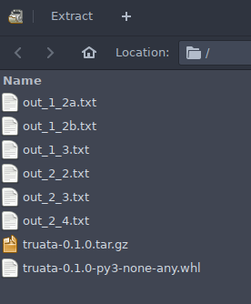
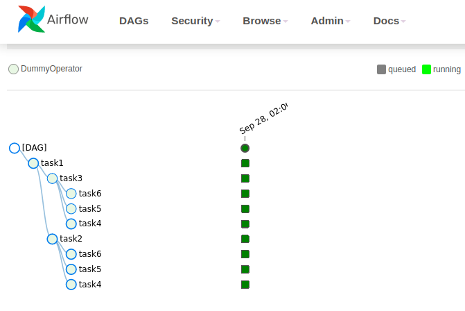

== Spark challenge

The execution of all the parts of this practice is **fully automated** in a
makefile. Just running a `make` in the terminal will download all the input
data files and run the scripts that generate the required output.

This repository also contains a **CI pipeline** that is executed with every
push. As results of the execution you can find the generated Python package
and the output files as artifact.

=== Prerequisites

This repo contains a Python package created using
https://python-poetry.org/[Poetry]. Installing all the dependencies in a new
virtual environment is really easy with Poetry: `poetry install`. Start the
virtual env with `poetry shell` and run commands like `pytest` to check that is
working.

=== Tests

Use `make test` to run all the tests using pytest.

=== CI Pipeline

All the tests (and linters and type checkers) are run automatically when a push
to the GitHub repo is done. If the tests are all OK, a `make` is executed, so
the code will run using real data. The output of the executions can be found in
the artifacts of the CI pipeline:

=== Airflow

In case you have Airflow installed locally, with the DAG folder in the default
path, you can also run the DAG with `make part2_airflow`.

